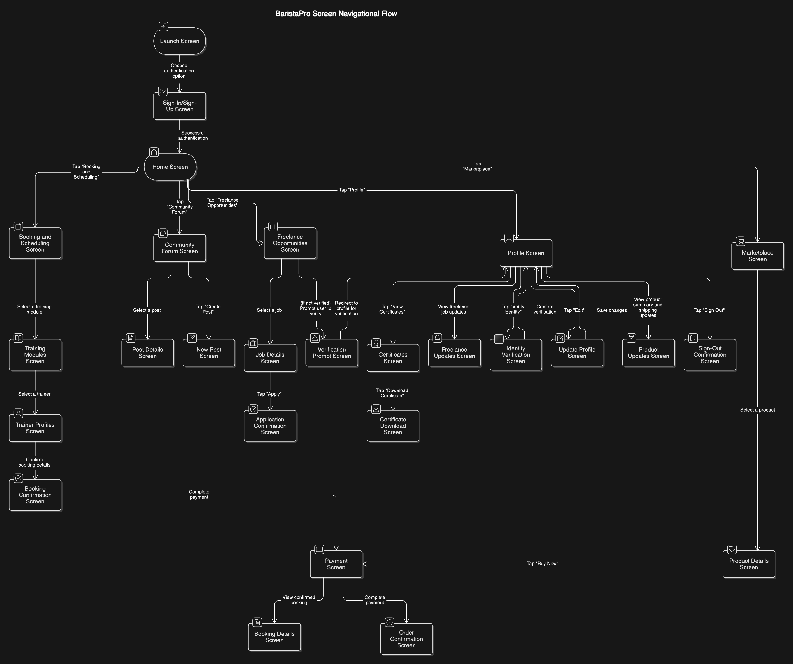
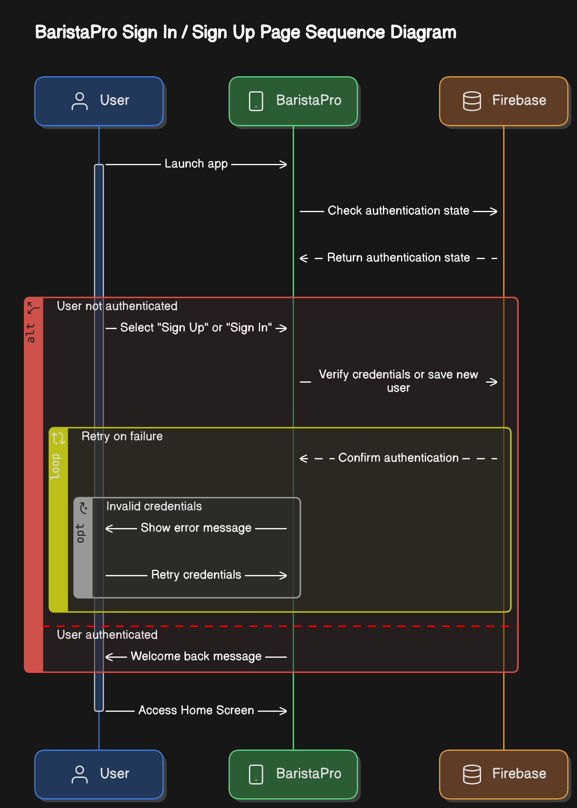
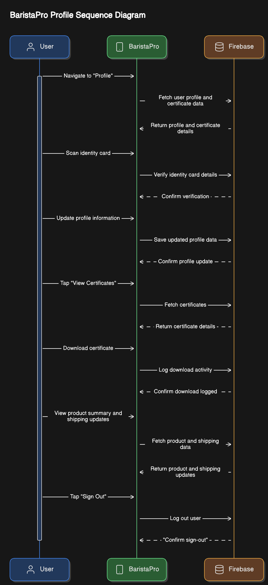
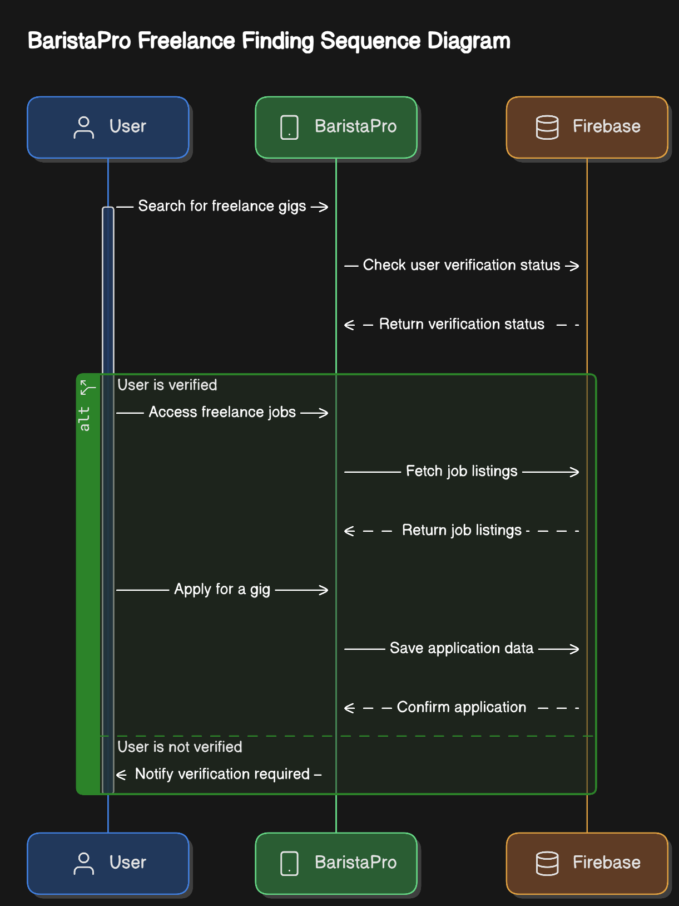
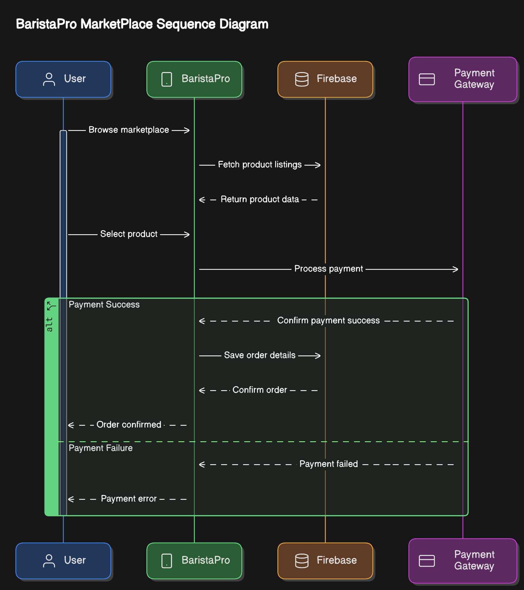
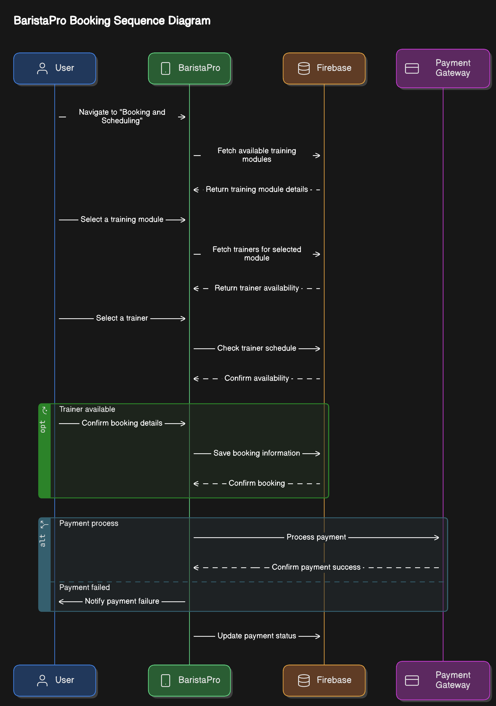
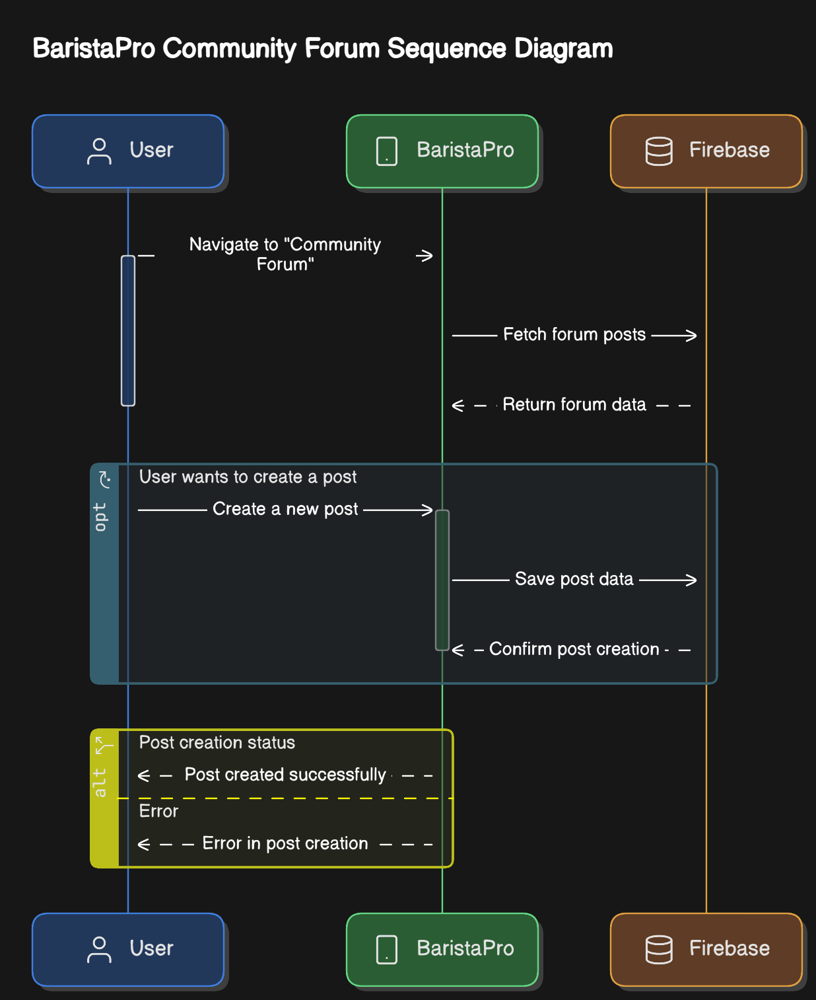
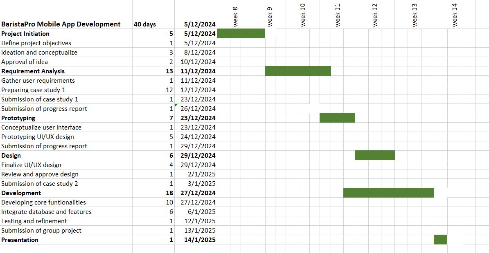

<h1 align="center">
   BaristaPro
</h1>
<!--

  

  

-->

## 👋 Hello, BaristaPro! 
Welcome to the BaristaPro Project GitHub! We are excited to share our application designed for coffee lovers and professionals alike.

## Description

BaristaPro is a cutting-edge application that provides users with a comprehensive toolset to explore coffee recipes, track brewing techniques, and enhance their coffee-making skills. 

## App Functionality

- **Recipe Database**: Access a vast collection of coffee recipes from around the world.
- **Brew Timer**: Utilize a built-in timer for various brewing methods to ensure perfect extraction.
- **Personalized Coffee Journal**: Keep track of your favorite recipes, brewing methods, and tasting notes.
- **Community Sharing**: Share your favorite recipes and brewing tips with other users.
- **Tutorials and Guides**: Learn from expert baristas through video tutorials and step-by-step guides.

Feel free to contribute to BaristaPro and help us make it even better!

## 1. Project Initiation (danish)

### i. Our Mobile App Detail

#### 1. title : BaristaPro :
   - The Gateway to Professional Coffee Training
#### 2. background of the problem : 
   - Finding reasonably priced, easily accessible, and excellent training programs to advance their talents is frequently a challenge for coffee lovers and aspiring baristas. Traditional training programs can be costly, location-specific, and have a narrow focus, which puts a barrier between professionals who are willing to share their knowledge and learners. Professional coffee trainers and baristas, meanwhile, do not have a specific platform to advertise their services, engage with students, and demonstrate their abilities.
#### 3. purpose or objective :
##### By developing an approachable, user-friendly platform that links aspiring baristas with coffee specialists, BaristaPro hopes to democratize professional coffee instruction. The app seeks to offer:

   - Users can learn barista techniques at their own pace with the help of extensive training modules.
   - A marketplace offering well chosen barista resources and gear.
   - networking possibilities in the coffee sector.
   - a route for students to obtain certificates and employment prospects.
#### 4. target user :
   ##### Primary: - Coffee enthusiasts, aspiring baristas, and home brewers who want to enhance their coffee-making skills.
   ##### Secondary: - Professional baristas, coffee trainers, and coffee shop owners seeking skilled staff or freelance baristas.
#### 5. preferred platform :
   - Native mobile app approach with iOS and Android compatibility to maximize accessibility.
#### 6. features and functionalities :
Key Features  
   ##### Training Modules:  
   - Provide step-by-step courses covering coffee brewing techniques, latte art, equipment handling, and customer service.  
   - Include beginner, intermediate, and advanced levels.  

   ##### Expert Barista Profiles:  
   - Showcase professional trainers with their qualifications, specialties, and availability.  
   - Trainers can offer in-person or virtual workshops.  

   ##### Booking and Scheduling:  
   - Allow users to book one-on-one or group training sessions with experts.  

   ##### Certification Programs:  
   - Offer certificates upon completion of training modules, verified by industry professionals.  

   ##### Marketplace for Resources:  
   - A section where users can purchase coffee equipment, beans, and other barista essentials recommended by experts.  

   ##### Community Forum:  
   - Create a space for aspiring baristas and trainers to connect, share experiences, and discuss industry trends.  
 
   ##### Freelance Opportunities:  
   - Help certified baristas find job opportunities or freelance gigs by connecting them with cafes and coffee shops.

### ii. Why and How do you come up with this mobile app.

   #### Why:
Global interest in specialty coffee culture gave rise to the concept for BaristaPro. There is a definite need for professional and easily available coffee education given the growth of third-wave coffee businesses and home brewing hobbyists. Meeting this demand is challenging, though, due to a lack of training alternatives and the disconnect between learners and experts. BaristaPro has the ability to revolutionize the way coffee skills are taught and shared around the world by tackling these issues.

   #### How:
After studying the problems faced by trainers and coffee lovers, the features were created. The necessity for an organized forum where baristas could network and teach was brought to light by their feedback. Conversely, learners said that they wanted flexibility, affordability, and access to professional advice. The app was designed to close this gap by fusing industry tools, networking, and e-learning into a single, all-inclusive solution.

The necessity for coffee professionals to build reputation and make money off of their knowledge, as well as trends in related e-learning platforms, led to the inclusion of particular features like certifications and a resource marketplace. Selecting a mobile-first platform guarantees ease of use and accessibility, fitting in with the routines of contemporary professionals and learners.

## 2. Requirement Analysis (fatin)

### i. Data Storage for CRUD Operations:
The app will utilize **Firebase Real-Time Database** for storing user profiles, training modules, booking information, and community forum posts. Firebase ensures real-time synchronization, allowing users to always see the latest data.

#### CRUD Operations:
- **Create**: Users can create profiles, submit training modules, book sessions, and post in the forum.
- **Read**: Users can view available training modules, expert profiles, community discussions, and their booking history.
- **Update**: Users can update their profiles, modify bookings, and edit forum contributions.
- **Delete**: Users can delete their profiles, cancel bookings, or remove forum posts.

#### Data Structure:
- **Users Collection**: Stores user profiles and their data.
- **Trainers Collection**: Stores information about trainers.
- **Training Modules Collection**: Stores available training content.
- **Bookings Collection**: Stores booking details and history.
- **Forum Collection**: Stores forum threads and discussions.

The data structure is designed to optimize for efficient data retrieval and management.

### ii. Packages and Plugins:

#### Essential Flutter Packages:
- **firebase_core**: Initializes Firebase within the app.
- **firebase_auth**: Manages user authentication for secure login and signup processes.
- **cloud_firestore**: Facilitates CRUD operations with Firestore.
- **provider**: Implements state management for a reactive UI.
- **intl**: For formatting dates and times, particularly useful for scheduling.
- **flutter_calendar**: Provides a visual interface for booking and scheduling sessions.
- **flutter_slidable**: Enables swipeable list items for booking and forum interactions.
- **google_fonts**: Provides custom typography to enhance the app's visual aesthetics.
- **flutter/material.dart**: For building responsive layouts and utilizing Material widgets like buttons, cards, and dialogs.

#### Integration Assessment:
Evaluate the performance of these packages to ensure the app remains responsive and efficient, especially on lower-end Android devices.

#### Back-End Framework:
- Firebase serves as the back-end solution, handling authentication, data storage, and real-time synchronization.
- Flutter is used for front-end development, building a responsive UI optimized for Android devices.

---

### iii. Compatibility with Chosen Platform

#### a. Android Compatibility:
- The app will be optimized for Android devices, ensuring it works across various screen sizes and resolutions.
- **Material Design** principles will be followed to create a visually appealing and intuitive user interface.

#### b. Platform-Specific Features:
- **Push Notifications**: Implement **Firebase Cloud Messaging (FCM)** to notify users about upcoming training sessions, new forum posts, or messages from trainers.
- **Location Services**: Use Flutter's **location** package to help users find nearby coffee shops offering workshops or freelance opportunities.
- **Google Maps Integration**: Display nearby locations with **google_maps_flutter** to enhance the user experience.

#### c. Testing:
- Conduct extensive testing across a range of Android devices to identify and resolve any compatibility issues.
- Ensure the app's performance remains optimal on lower-end devices through Firebase Performance Monitoring.

### iv. Sequence Diagram & Screen Navigational Flow
### Navigational Flow

### Sequence Diagram
a. Sign Up Sequence Diagram

   

b. Profile Sequence Diagram

   

c. Free lancer Sequence Diagram

   

d. Market Place Sequence Diagram

   

e. Booking Sequence Diagram

   

f. Community Forum Sequence Diagram

   

## 3. Planning (mazidah)

### i. Gantt chart

## 4. References
1. Kvartalnyi, N., & Kvartalnyi, N. (2024, August 20). A guide to the application development Life cycle. Inoxoft |. https://inoxoft.com/blog/stages-of-app-development/
2. OpenAI. (2024). ChatGPT (December 22, 2024). Retrieved from https://chat.openai.com/

